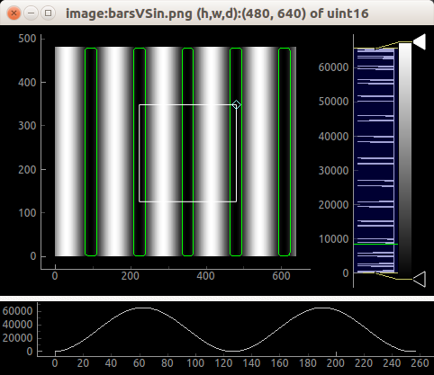

# Imaging
## image_analysis.py
Common image analysis using pyqtgraph and optionally, OpenCV.

- Wide range of image formats.
- 16-bit grayscale images supported (requires openCV).
- Image orientation and rotation (program options -x, -y, -R).
- Interactive zooming, panning.
- Contrast control: displays histogram of image data with movable region defining the dark/light levels.
- ROI and embedded plot for measuring image values.
- Isocurves.
- Export as PNG, TIFF, JPG,..., SVG?, Matplotlib, CSV, HDF5.
- Docking view.

