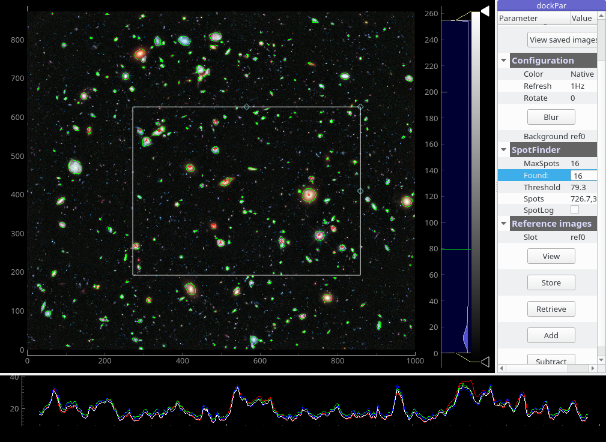

# Imaging
## imageAnalyzer.py
Common image analysis using pyqtgraph and optionally, OpenCV.

Features:
- Input source: file, EPICS (requires pyepics), ADO (requires cns.py).
- Accepts data from vectored ADO parameters, user have to define the array shape (program options: -w --width,height,bits/channel).
- Wide range of image formats.
- 16-bit/channel images supported (requires PyPNG or OpenCV).
- Image orientation and rotation (program options: -o and -R).
- Interactive zooming, panning, rotation.
- Contrast control: Displays histogram of image data with movable region defining the dark/light levels.
- ROI and embedded plot for measuring image values.
- Isocurves. The isocurve level defines the threshold for spot finding.
- Fast multi-spot finder, reports and logs centroid position and integral of most intense spots in the ROI.
- Export as PNG,TIFF, JPG..., SVG?, Matplotlib, CSV, HDF5.
- Interactive python console with access to image data, graphics objects and shell commands (program option: -c).
- Configuration and reporting in the parameter dock.
- Image references: save/retrieve image to/from a reference slots.
- Binary operation on current image and a reference: addition, subtraction.
- Continuous background subtraction.
